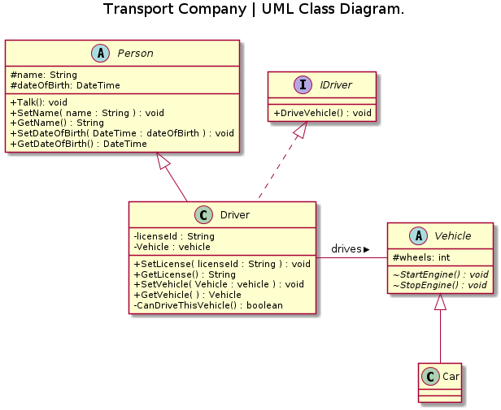
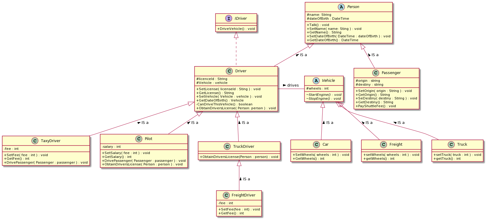

# Intro al Paradigma Orientado a Objetos.
> Charla por Roberto Miñagorri.

## Reto:

- `Passanger`: es un `Person` que tiene un punto de origen y uno de destino (`origin` y `destiny`) y sabe que debe pagarle al conductor que lo llevó.

- Un `TaxiDriver` es un `Driver` que sabe llevar al `Passenger` de su origen a su destino por una tarifa monetaria, un monto fijo llamado `fee`.

- Un `Pilot` es un `Driver` que tiene una licencia empieza que por `"Pro-"`, tiene la capacidad de conducir a alta velocidad y cobra un sueldo de por lo menos un millón. Esta licencia solo se adquiere a partir de los 22 años.

- Un `FreightDriver` es un `Driver` que tiene una licencia que empieza por `"Heavy-"`, tiene la capacidad de conducir `Truck`'s por una tarifa monetaria, un monto fijo llamado `fee`. Esta licencia solo se adquiere a partir de los 20 años.

- `Freight` tiene 8 o 10 ruedas. Soporta cargas expresadas en toneladas.

- Una licencia regular solo se adquiere a a partir de los 18 años.

## Notas:

- __Importante:__ Desde el `Main()`, o cualquier parte de la clase `Program`, ningún vehículo puede ser encendido ni apagado por nadie que no sea un conductor.

- Aplique los conocimientos del Paradigma de Programación Orientado a Objetos para esto.

- Aplique código limpio.

- Nota: Es posible que necesite refactorizar.

- Envie sus cambios a este repositorio en un "branch" personal.

## Diagrama de clases

## Diagrama de clases Actualizado

